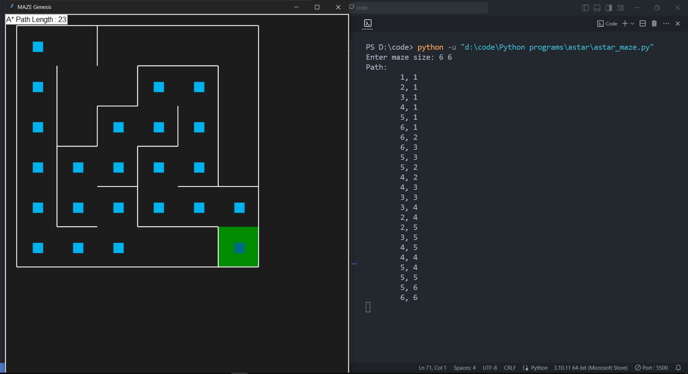
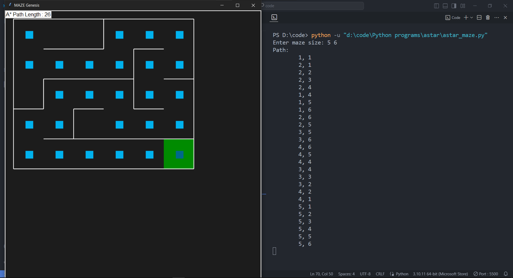

# A* Pathfinding Algorithm for Mazes

This Python script implements the A* pathfinding algorithm to navigate a maze using the `pyamaze` library. The script generates a maze, computes the shortest path from the start to the goal using A*, and visualizes the path on the maze.

## Dependencies

This script requires the `pyamaze` library. Install it using pip:

```bash
pip install pyamaze
```

## Usage

- **Input Maze Size:**
  - When prompted, enter the dimensions of the maze in the format `length width` (e.g., `10 10`).

- **Execution:**
  - The script will:
    1. Generate a maze of the specified size.
    2. Use the A* algorithm to find the shortest path from the start `(1,1)` to the goal `(length, width)`.
    3. Display the path and its length.
    4. Visualize the maze with the path traced out.

## Code Explanation

### `aStar(m)`

- **Parameters:**
  - `m`: An instance of the `pyamaze` maze class.

- **Returns:**
  - `imgpath`: A dictionary mapping the path for visualization.
  - `txtpath`: A list of coordinates representing the path from start to goal.

- **Description:**
  - Implements the A* algorithm for pathfinding.
  - Uses a priority queue to explore the shortest paths first.
  - Calculates the heuristic using Manhattan distance.

### `h(cur, goal)`

- **Parameters:**
  - `cur`: Current cell coordinate.
  - `goal`: Goal cell coordinate.

- **Returns:**
  - The Manhattan distance between `cur` and `goal`.

- **Description:**
  - Computes the heuristic function for A* (Manhattan distance).

### `showPath(path)`

- **Parameters:**
  - `path`: A list of coordinates representing the path.

- **Description:**
  - Prints the path coordinates.

## Main Execution

- **Maze Creation:**
  - Creates a maze with user-defined dimensions.

- **Pathfinding:**
  - Calls `aStar` to find and display the path.

- **Visualization:**
  - Uses `pyamaze` to visualize the maze and the computed path.
  - Adds a label indicating the path length.

## Screenshots

Below are two images showing the maze and the path found by the algorithm:

- **Sample Visualization 1:**
  

- **Sample Visualization 2:**
  
